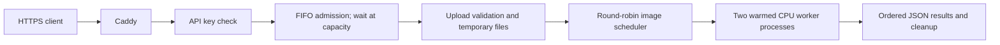

# Box condition inference API

A CPU inference API for detecting box conditions in uploaded photographs. This
project demonstrates batch uploads, process-based ML inference, fair scheduling,
queue backpressure, authentication, and a reproducible HTTPS deployment.

**Live demo:** pending VPS and domain setup. Once deployed, reviewers can open
`https://YOUR_HOSTNAME/docs`, click **Authorize**, enter the privately shared
demo key, then upload the two images in [samples/](samples/README.md).
The trained `models/best.pt` is included so cloning the repository is enough to
run inference. See [deployment instructions](deploy/README.md) for Hetzner.

## Try it

```sh
git clone https://github.com/sepehringo/box-condition-api.git
cd box-condition-api
python3.11 -m venv .venv
source .venv/bin/activate
python -m pip install -r requirements-api.txt
python -m uvicorn box_api.app:app --workers 1
```

Open <http://127.0.0.1:8000/docs> or upload both sample images with curl.
Local development allows requests without a key when `BOX_API_KEY` is unset.
Setting it enables authentication. Hosted Docker deployments always require a
random key of at least 32 characters.

```sh
curl --fail-with-body --max-time 240 http://127.0.0.1:8000/v1/predict \
  -F 'files=@samples/box-1.jpg' -F 'files=@samples/box-2.jpg'
```

For the hosted demo, use [examples/request.sh](examples/request.sh) with
`BOX_API_URL` and `BOX_API_KEY` set in your shell. A real sample response is saved
in [examples/response.json](examples/response.json). Its request ID changes each call.
Authentication is checked before queue admission and multipart parsing. Missing,
incorrect, or duplicate keys return 401; docs and health endpoints are public.

## How the code fits together

Start reading at [`predict()` in box_api/app.py](box_api/app.py): it validates
uploads, submits a job, and returns ordered results. Follow the flow below.



[`middleware.py`](box_api/middleware.py) checks access and admission before reading
the body. [`scheduler.py`](box_api/scheduler.py) manages fairness and deadlines;
[`worker.py`](box_api/worker.py) runs the model. [`inference_core.py`](inference_core.py)
shares inference and serialization with the CLI. [`benchmark_api.py`](scripts/benchmark_api.py)
measures the running API; [`benchmark_matrix.py`](scripts/benchmark_matrix.py)
launches temporary servers to compare worker settings.

## Measured performance and limitations

[The recorded Mac CPU benchmark](results/api_benchmark_cpu.json) contains 30
combinations of 1/2/4 workers, concurrency 1/5/10/25/40, and batches of 1/5 images.
All 1,200 measured requests returned 200, including concurrency above the
32-request admission cap. Approximate throughput was 11, 18, and 29–30 images/sec
with 1, 2, and 4 workers. Peak combined memory was roughly 575, 1,114, and
2,203 MiB. These are development measurements on macOS ARM, not a Hetzner guarantee.
The two benchmark inputs are the same images now included in `samples/`, with
their original dataset filenames preserved in the report.

The model's detections can be wrong or empty; this project does not claim
validated accuracy on unseen business data. The demo accepts invited reviewers
with a shared key. Queues are in memory, and sustained overload can exceed the
60-second queue deadline. See [sample attribution](samples/README.md).

The service accepts batches of images and concurrent clients, returns JSON in the
same response, and uses a bounded pool of CPU inference processes. Every process
owns one warmed-up YOLO model; HTTP requests never share model objects.

## Setup and launch

Use Python 3.11 for the existing pinned PyTorch 2.1 / Ultralytics 8.0 dependencies.
Keep the existing model at models/best.pt; no training or model download is needed.

~~~sh
source .venv/bin/activate
python -m pip install -r requirements-api.txt
python -m uvicorn box_api.app:app --host 127.0.0.1 --port 8000 --workers 1
~~~

Use exactly one Uvicorn process: its inference worker pool already provides CPU
parallelism. For internal server deployment, use --host 0.0.0.0 behind existing
network access controls. Keep training separate from the running service.

~~~sh
curl -X POST http://127.0.0.1:8000/v1/predict \
  -F 'files=@image1.jpg' -F 'files=@image2.png' -F 'confidence=0.5'
~~~

The response contains a request_id and ordered results. Each image result includes
index, filename, width, height, and predictions using the CLI's id, class,
class_id, confidence, and box fields. Bounding boxes use pixel coordinates in the
decoded image, including JPEG EXIF orientation. An image without detected boxes returns predictions: [].
Duplicate filenames are supported; index identifies the corresponding input.
Supported image formats are JPEG, PNG, and BMP. Uploaded filenames are never used
as storage paths. Invalid input fails the whole request; there are no partial
success responses or stored results.

Open /docs for the upload interface, /health for liveness, and /ready for model
readiness and current admission/worker counts.

## Queue behavior

1. Admission is FIFO. Up to 32 requests may be admitted, including uploads,
   queued inference, and work still running after an HTTP timeout.
2. Once this cap is reached, additional requests wait before their multipart
   bodies are read. Transport backpressure pauses uploading rather than returning
   a capacity-based 503.
3. Admitted files are copied to unique temporary directories. Only an active
   inference process decodes a full image.
4. The scheduler dispatches images round-robin across ready requests and submits
   at most one task per available inference worker.
5. Admission waiting plus waiting for the first inference task has a cumulative
   60-second limit. Upload and validation time is excluded from this queue budget.
   After the first task is dispatched, the whole request has 60 seconds to finish,
   including remaining batch scheduling. Both inference-related timeouts return 504.
6. Upload body reads have a separate 60-second deadline after admission and
   return 408 on expiry. The body byte limit includes multipart overhead.
7. Disconnected or timed-out requests lose their unscheduled images. Already
   submitted work is allowed to finish and retains its files and admission slot
   until cleanup completes. Disconnects while waiting for admission are noticed
   once reading resumes, or their admission deadline expires.

The queue is temporary and does not survive a server restart. It absorbs bursts;
sustained arrivals above processing capacity can still time out. Waiting
connections consume server resources. The hosted demo uses privately invited
reviewers with a shared API key.

Do not set Uvicorn --limit-concurrency: it returns 503 instead of waiting.
Readiness returns 503 when workers are unavailable; prediction requests use 500
for worker failures. Input errors use 422 and upload size limits use 413.

Configure clients and proxies to allow at least 150 seconds **plus upload time**.
For nginx, disable request buffering so waiting uploads aren't buffered by the
proxy, and align its body and read/send timeouts:

~~~nginx
location / {
    proxy_pass http://127.0.0.1:8000;
    proxy_http_version 1.1;
    proxy_request_buffering off;
    client_max_body_size 50m;
    client_body_timeout 150s;
    proxy_send_timeout 150s;
    proxy_read_timeout 150s;
}
~~~

Keep the reverse proxy's and client's limits consistent with any overrides below.
No application-level rejection on queue saturation can guarantee delivery during
network failures, process crashes, or operating-system connection exhaustion.

## Configuration

Environment variables are read when the app is imported.

| Variable | Default | Purpose |
| --- | --- | --- |
| BOX_MODEL_PATH | models/best.pt relative to project | Weights |
| BOX_DEVICE | cpu | cpu or mps |
| BOX_WORKERS | 2 | Inference processes |
| BOX_TORCH_THREADS | 1 | PyTorch CPU threads per process |
| BOX_MAX_REQUESTS | 32 | Admitted requests, including uploads and running cleanup |
| BOX_MAX_IMAGES | 16 | Files per request |
| BOX_MAX_FILE_BYTES | 10485760 | Per-image encoded bytes |
| BOX_MAX_BODY_BYTES | 52428800 | Entire HTTP request body bytes |
| BOX_MAX_PIXELS | 20000000 | Decoded image pixels |
| BOX_QUEUE_TIMEOUT | 60 | Cumulative admission and first-task wait seconds |
| BOX_PROCESSING_TIMEOUT | 60 | Seconds from first task dispatch to batch completion |
| BOX_UPLOAD_TIMEOUT | 60 | Upload body read deadline after admission |
| BOX_STARTUP_TIMEOUT | 180 | Model loading/warmup deadline |
| BOX_TEMP_ROOT | system temporary directory | Existing directory for uploads |
| BOX_API_KEY | unset locally | Shared X-API-Key; unset disables local authentication |
| BOX_REQUIRE_API_KEY | false locally; true in Docker | Fail startup without a non-placeholder key of at least 32 characters |

For optional Mac acceleration, set BOX_DEVICE=mps and BOX_WORKERS=1. Test CPU mode
first to match production. The CLI's --device option now applies to image and
folder predictions too, and annotations reuse the prediction rather than
running the model twice.

Keep workers * threads within the allocated CPU budget, then benchmark. Account
for one model copy per process and disk space for up to MAX_REQUESTS *
MAX_BODY_BYTES of admitted upload data, plus temporary multipart spooling
(approximately twice that amount during copying). Leave capacity for the API,
system processes, and unrelated workloads.

## Tests

~~~sh
python -m pip install -r requirements-dev.txt
python -m unittest discover -s tests -v
BOX_RUN_MODEL_TESTS=1 python -m unittest tests.test_model_integration -v
~~~

Unit/API tests inject controlled workers to verify limits, admission before body
reading, fairness, response ordering, timeout cleanup, cancellation, and process
pool failure. The opt-in integration test loads the actual model in two spawned
CPU workers, submits concurrent batches, and compares with sequential prediction.

## Benchmark

Start the server on CPU, then run:

~~~sh
python scripts/benchmark_api.py --image samples/box-1.jpg samples/box-2.jpg \
  --concurrency 1 5 10 25 --requests 100 --batch-size 1
~~~

Repeat with BOX_WORKERS=1, 2, and 4, where available CPU and memory permit.
Repeat with --batch-size 5 and 16. Reported values include successful images/sec,
p50/p95/p99 latency, statuses, timeout rate, and peak queue/worker counts.
The server logs queue wait and processing times for successful requests.

Optionally pass --server-pid PID to sample the combined API/worker RSS, and
--temp-root DIR (matching BOX_TEMP_ROOT) to sample upload disk use. Use
--output results.json to save a report. Repeat on the actual CPU server; Mac
measurements are a development baseline, not a production throughput promise.
For authenticated servers, export `BOX_API_KEY`; the benchmark reads it from the
environment. Use `--timeout 240` for the hosted demo.

To launch and shut down temporary CPU servers automatically for a full matrix:

~~~sh
python -m scripts.benchmark_matrix --image image1.jpg image2.png \
  --workers 1 2 4 --concurrency 1 5 10 25 40 --batch-size 1 5 --requests 40
~~~

This writes results/api_benchmark_cpu.json and verifies temporary uploads are
removed after each server shuts down.
